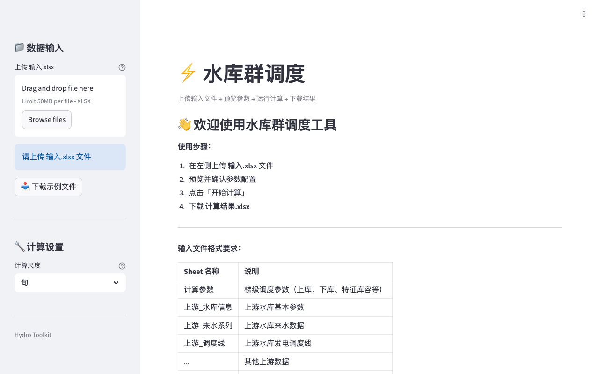

# ⚡ Hydro Reservoir — Reservoir Scheduling

[](https://github.com/zengtianli/hydro-reservoir)
[](LICENSE)
[](https://python.org)
[](https://streamlit.io)
[](https://hydro-reservoir.tianlizeng.cloud)

Cascade reservoir hydropower scheduling optimizer with interactive Plotly charts.



## Features

- **Cascade scheduling** — joint optimization of multiple reservoirs in series
- **Flexible time step** — daily, 10-day, or monthly calculation intervals
- **Interactive charts** — Plotly-based visualization of water levels, flow, and power output
- **Parameter preview** — inspect reservoir parameters, inflow series, and dispatch curves before computing
- **Excel I/O** — upload input workbook, download detailed scheduling results

## Quick Start

```bash
git clone https://github.com/zengtianli/hydro-reservoir.git
cd hydro-reservoir
pip install -r requirements.txt
streamlit run app.py
```

## Deploy (VPS)

```bash
git clone https://github.com/zengtianli/hydro-reservoir.git
cd hydro-reservoir
pip install -r requirements.txt
nohup streamlit run app.py --server.port 8502 --server.headless true &
```

## Hydro Toolkit Plugin

This project is a plugin for [Hydro Toolkit](https://github.com/zengtianli/hydro-toolkit) and can also run standalone. Install it in the Toolkit by pasting this repo URL in the Plugin Manager. You can also **[try it online](https://hydro-reservoir.tianlizeng.cloud)** — no install needed.

## License

MIT
